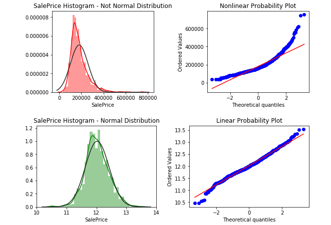
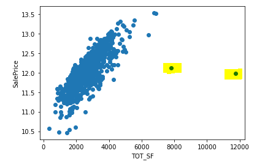
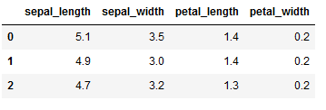
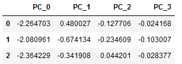

# Iowa House-Prices
*Price prediction model using regularized regression and machine learning techniques.*
***
#### <ins>Regression Summary</ins>

This model, written in Python, predicts house prices.  The regression model was tuned using cross-validation (CV) with Root Mean Squared Error (RMSE) and the coefficient of determination, R2.  Cross validation returned RMSE for each fold.  The RMSE can be inspected and the standard deviation of the RMSEs taken to assess model fit quality and model stability.

R2, explains what portion of house prices are explained by the features (the independent variables).

Good models need a reality-check to make sure the model generalizes to unseen data, which we call **holdout** data.  After fitting/scoring the model with CV, I also scored model predictions on the holdout data.

The best model was Ridge, which was unsurprising as model dimensionality was high compared to available observations.  Ridge reduced the complexity of the model by regularizing the features.  It does this by penalizing some features with low weights, decreasing model complexity.  The regularization also helps with multicollinear features. (Principal Component Analysis will cut the number of features to a smaller number of uncorrelated principal components.  See below.)

Certain collinear features were combined or dropped.  For example, GarageArea, which is highly correlated to GarageCars, was dropped.  Polynomial features were added, which improved model prediction, despite collinearity.

#### <ins>Feature Engineering</ins>

A great deal of thought is required to provide good features to regression models.  Skewed data, outliers, data on different scales, unencoded data, missing data, and collinear data are part of the feature engineering challenge.

It turns out that variables with a Guassian, or bell curve shaped distribution, work better in regression models.  This includes not only the features.  It applies to our prediction target house sales price also.

Below, the house price is normalized to Guassian using the natural log transformation.  Note any transformation that normalizes to Guassian is good.  In my research, I found the [Yeo Johnson power transformation (YJ)](https://docs.scipy.org/doc/scipy/reference/generated/scipy.stats.yeojohnson.html) is a good replacement for the log transformation.

<ins>**Normalizing the prediction target, house price:**</ins>

Also, not our goal is to predict house price in dollars.  So any transformation must be mathematically reversable.  Please see my notebook for the inverse transformations for LN(x+1) and YJ(x).  They are derived using the log rules to solve for our original variable x.
***
#### <ins>Data Cleaning</ins>
Missing data was cleaned on a case-by-case basis after thorough exploration.  For example, missing KitchenQual was replaced with the most common quality, 'TA'.  KitchenQual was presented as a categorical variable, but it is actually ordinal--the categories have a meaningful order.  It was updated as follows:

* **Before:** `[Ex, Gd, TA, Fa, Po, None]`
* **After:**  `[5, 4, 3, 2, 1]`

Sometimes, more advanced logic is required.  Missing zoning categories were imputed using Neighborhood.  I wrote a custom function to do this transparently.  However, it may also be done by chaining together Pandas aggregation functions in a single line of code.

The yellow-shaded outlier square footages were dropped.

<ins>**Outlier chart:**</ins>

There were many skewed features.  I optimize feature skew in train and apply the same transform to test, avoiding data leakage.  The aggressiveness of the transform is determined by train only.  If the transform worsens the skew metric, no transform is applied.  The numeric feature skew corrections were sufficient--no scaling was applied to untouched, low-skew numeric features.

#### <ins>Categorical Features</ins>
Sometimes, a numeric feature is actually a categorical feature.  MSSubClass, the dwelling type, is such a feature.  It was cast as categorical so it could be subsequently one-hot encoded.

Categorical features were one-hot encoded.  While one-hot encodings may predict well, they increase model dimensionality.  This was mitigated by Ridge regularization and by dumping one-hot columns that were over 99.5% zeroes.  Let's call these **invariant** columns.
Other invariant columns, independent of any encoding, were dropped.

High cardinality categorical features are features with many unique values.  This sort of features creates many one-hot columns, blowing up dimensionality!  Feature binning works to mitigate this in some cases.  For example, the twelve months in 'MoSold' were converted to the four seasons and only then one-hot encoded.  

There are other encoding techniques like [Leave-One-Out-Encoding (LOOE)](http://contrib.scikit-learn.org/categorical-encoding/leaveoneout.html) to handle high cardinality scenarios.  **Leave-One-Out** calculates the mean target by category ("level"), but excludes the current row (and optionally adds noise) to avoid overfitting.  I didn't try LOOE because it is better for binary classification.

#### <ins>Principal Component Analysis</ins>
Another way to deal with the high dimensionality (too many columns) issue is to compress the columns into fewer columns using [Principal Component Analysis (PCA)](https://scikit-learn.org/stable/modules/generated/sklearn.decomposition.PCA.html).  PCA maximizes data variance (equivalently, minimizing residual error), which sidesteps dealing with invariant columns manually.  Remember to standardize the features before applying PCA!

Unfortunately, PCA makes the model harder to explain.  Each principal component is a mix of the original features.  In the [Iris](https://archive.ics.uci.edu/ml/datasets/iris) example below, we see the transformed data bears no relation to the original data.

<ins>**Iris Data:**</ins>

<ins>**Transformed Iris Data - after StandardScaler and PCA:**</ins>

The benefit is that we can reduce the dimensions of our model.  PC_0 and PC_1, half of the original columns, explain over 95% of model variance.
***
#### <ins>Enhancements</ins>
Future model enhancements include stacking or averaging multiple models.  For example, averaging the results of Ridge regression and tree-based regression.  Multi-model ensembles improve model accuracy, the signal, while averaging out noise that differs across models.

Also, engineering more high correlation features will improve model accuracy.  I suspect affluent buyers pay a big premium for high condition houses over low condition.  Conversely, low-end buyers may pay a small premium for high condition over low condition.  Maybe a feature averaging price by Neighborhood/Condition will capture buyer price sensitivity.
***
#### <ins>Result</ins>
The Ridge notebook scored in the top 20% on the Leaderboard.  This was achieved with a standalone Ridge Regression.  This single-model approach avoids the higher complexity and lower transparency of model stacking or model averaging.

*`Edit 02-14-2020`*
Added a LightGBM notebook that scored in the **top 4% on the Leaderboard**.  The LightGBM model used the same data as the Ridge model.  Categorical features were target encoded rather than one-hot encoded.
